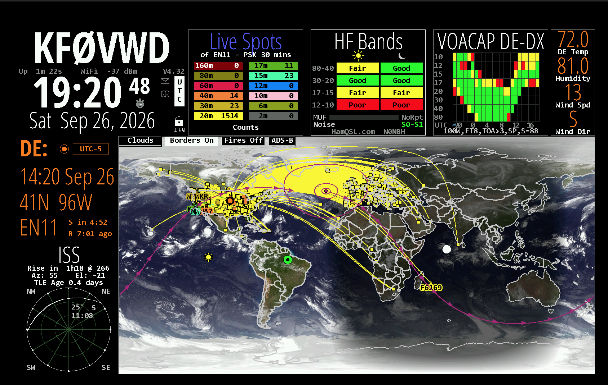

# HamClock Launcher

A wxPython-based GUI launcher for [HamClock](https://github.com/openhamclock/hamclock) on macOS, providing an easy-to-use interface for running and monitoring the HamClock web applications. It is distributed as a self-contained, signed and notarized .app with the HamClock binaries included, so no other software needs to be installed to use HamClock.

**Current release: 4.32** (bundles HamClock 4.32). Launcher version numbers match the bundled HamClock version.

Website and downloads: [machamclocklauncher.org](https://machamclocklauncher.org)



*In memory of Elwood Downey, WB0OEW (SK), creator of HamClock.*

## Overview

HamClock Launcher is a macOS desktop application that simplifies launching and managing HamClock instances. It captures and displays HamClock's output in real time, making it easy to monitor the application's status and debug any issues.

HamClock development now continues as the [Open HamClock](https://github.com/openhamclock/hamclock) project. The launcher connects to the Open HamClock Backend by default, and also supports hamclock.com and any other OpenHamClock-compatible server.

## Features

- **Easy Version Selection**: Choose from four HamClock display resolutions via a simple radio button interface:
  - 800x480
  - 1600x960
  - 2400x1440
  - 3200x1920
- **Backend Server Selection**: Choose the Open HamClock Backend (`ohb.hamclock.app:80`, default), hamclock.com (`hamclock.com:80`), or a custom OpenHamClock-compatible server (`host:port`). Your choice is remembered between sessions.
- **Real-time Output Monitoring**: View HamClock's output as it runs
- **Output Management**:
  - Automatic line limiting (5000 lines max) to prevent memory issues
  - Clear output button
  - Copy and select all functionality via Edit menu
- **Browser Integration**: One-click button to open HamClock at `http://localhost:8081/live.html`
- **Process Control**: Start and stop HamClock with visual status indicators
- **Safe Shutdown**: Prompts before closing if HamClock is still running
- **Clear HamClock Cache** (Tools menu): Deletes downloaded data in `~/.hamclock` while preserving your settings (`eeprom`)
- **Help Resources**: The bundled HamClock User Guide (`HamClockUserGuide.pdf`) and release notes are available from the Help menu

## Requirements

- macOS 10.14 or higher
- Separate DMGs are provided for Apple Silicon (`HamClockLauncher.dmg`) and Intel (`HamClockLauncherIntel.dmg`) Macs

## Updating HamClock

The bundled HamClock binaries have HamClock's built-in updater turned off, so HamClock will not try to update itself. Each new HamClock version is delivered as a new HamClock Launcher release. Download the latest DMG from the [website](https://machamclocklauncher.org) or the [Releases page](https://github.com/huberthickman/HamClockLauncher/releases) and replace the app in your Applications folder. Your HamClock settings are kept.

## Building the Bundled HamClock Binaries

The launcher runs the HamClock **web** binaries (`hamclock-web-800x480`, `hamclock-web-1600x960`, `hamclock-web-2400x1440`, `hamclock-web-3200x1920`) from the `hamclock_bin` directory inside the app bundle.

They are built from the Open HamClock source with two compile-time options defined:

| Define | Effect |
|---|---|
| `NO_UPGRADE` | Disables HamClock's in-app updater. The updater downloads the source and rebuilds HamClock in place, which would modify the signed app bundle, invalidate its code signature, and require developer tools most users don't have. |
| `NO_SYSTEM_CONTROLS` | Removes the "Reboot computer" and "Shutdown computer" items from HamClock's shutdown menu. They call `/sbin/reboot` and `/sbin/poweroff`, are intended for dedicated devices such as a Raspberry Pi, and need root on macOS. |

Add them to the macOS block of the HamClock `Makefile`:

```make
ifeq ($(shell uname -s), Darwin)
    CXXFLAGS += -I/opt/X11/include -I/opt/local/include
    CXXFLAGS += -DNO_UPGRADE -DNO_SYSTEM_CONTROLS
    LDXXFLAGS += -L/opt/X11/lib -L/opt/local/lib
endif
```

Then do a clean build of each web target, for example:

```sh
make clean
make hamclock-web-1600x960
```

Don't pass `CXXFLAGS=...` on the `make` command line; it replaces the Makefile's own include paths and the build will fail.

To confirm the defines took effect, start HamClock from the launcher (which passes `-o`, sending the diagnostic log to stdout). The output window should show `#define NO_UPGRADE` and `#define NO_SYSTEM_CONTROLS` near the top.

## License

This project is licensed under the MIT License.

Copyright (c) 2025-2026 Hubert Hickman

Permission is hereby granted, free of charge, to any person obtaining a copy
of this software and associated documentation files (the "Software"), to deal
in the Software without restriction, including without limitation the rights
to use, copy, modify, merge, publish, distribute, sublicense, and/or sell
copies of the Software, and to permit persons to whom the Software is
furnished to do so, subject to the following conditions:

The above copyright notice and this permission notice shall be included in all
copies or substantial portions of the Software.

THE SOFTWARE IS PROVIDED "AS IS", WITHOUT WARRANTY OF ANY KIND, EXPRESS OR
IMPLIED, INCLUDING BUT NOT LIMITED TO THE WARRANTIES OF MERCHANTABILITY,
FITNESS FOR A PARTICULAR PURPOSE AND NONINFRINGEMENT. IN NO EVENT SHALL THE
AUTHORS OR COPYRIGHT HOLDERS BE LIABLE FOR ANY CLAIM, DAMAGES OR OTHER
LIABILITY, WHETHER IN AN ACTION OF CONTRACT, TORT OR OTHERWISE, ARISING FROM,
OUT OF OR IN CONNECTION WITH THE SOFTWARE OR THE USE OR OTHER DEALINGS IN THE
SOFTWARE.

## About HamClock

HamClock was originally developed by Elwood Charles Downey (WB0OEW, SK) and is now maintained by Dave Koberstein as the [Open HamClock](https://github.com/openhamclock/hamclock) project.

HamClock is licensed under the MIT License. See the LICENSE file in the `hamclock_bin` directory for details.

## Acknowledgments

- Thanks to Elwood Downey for creating the HamClock software and making it available to the amateur radio community. 73, Elwood.
- Thanks to Dave Koberstein and the Open HamClock contributors for continuing HamClock's development.
- HamClockLauncher uses the cross-platform GUI library [wxPython](https://www.wxpython.org/)